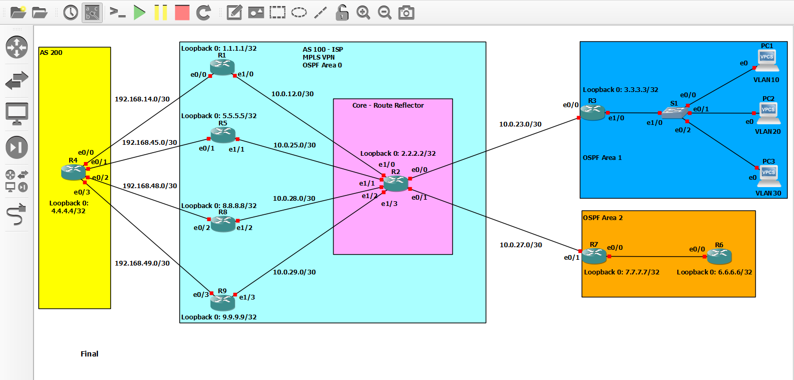

# Thuc-tap-tot-nghiep-PTIT

Lưu trữ LAB GNS3 thực tập tốt nghiệp PTIT

## 🚀 Giới thiệu dự án

Kho lưu trữ này chứa mô hình giả lập mạng nâng cao, sơ đồ topology, file cấu hình thiết bị và báo cáo kỹ thuật phục vụ đợt **Thực tập tốt nghiệp** tại Học viện Công nghệ Bưu chính Viễn thông (PTIT).

## 📁 Cấu trúc thư mục

* `configs/` : Chứa các file cấu hình chi tiết của Router, Switch (giao thức BGP, MPLS, OSPF...).
* `reports/` : Chứa tài liệu báo cáo kỹ thuật (định dạng PDF/Word).
* `TongHop_BGP_MPLS_OSPF.gns3` : File sơ đồ dự án GNS3 chính.

## 🛠️ Công cụ & Công nghệ sử dụng

* Mô hình giả lập: GNS3
* Thiết bị mạng: Cisco IOS Router / Switch
* Công nghệ cốt lõi: BGP, MPLS, OSPF, Định tuyến nâng cao và Phân đoạn mạng.
